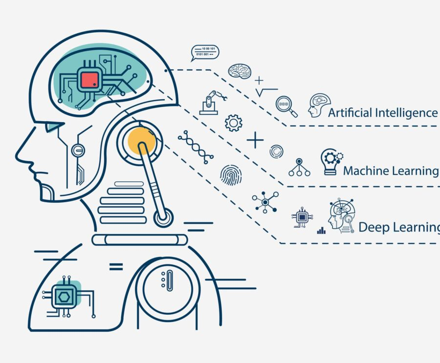

### I. Introduction
Over the past few years, artificial intelligence has started to integrate itself into society, becoming a powerful asset across various sectors. Professionals, educators, students, and various other occupations have all reaped the benefits of AI's capabilities. In the realm of software engineering, AI has evolved into a valuable "coding assistant" for many. It can be used for code generation and error detection to explain concepts. As time goes on, tools such as ChatGPT, GitHub Copilot, and Google Gemini will only get better and more accurate, assisting in the development of efficient and interactive projects.

### II. Personal Experience with AI:
I have used AI in class this semester in the following areas:

  1. Experience WODs 
In order to gain the fundamental knowledge, I refrained from leaning on AI during the Experience WODs. These exercises are designed to help teach the foundational aspects of specific areas or skills, so it would be the most beneficial to attempt them without external assistance. If there were ever any challenges when completing the WODs, I relied on the resources within the course materials and documentation, which would almost always be enough information to be able to complete the experience WOD.
  
  2. In-class Practice WODs\
Just like with the experience WODs, I used the in-class practice WODs to improve my problem-solving skills under time constraints. Since these in-class exercises weren't graded, so I approached them as opportunities to solely focus on practicing my skills without depending on AI.
  
  3. In-class WODs\
For the In-class WODs, I initially refrained from using AI tools as they were more focused on Javascript skills such as laying out algorithms and data structures to fit the specifications for the WOD. However, as the class shifted to more web development using HTML and CSS I began to use AI tools to improve the efficiency of writing code, especially for formatting and style.

  4. Essays\
Throughout this course, the majority of the essays provided an opportunity to express technically dense concepts with a creative and personal flair, which make them more engaging and relatable. To preserve that flair, I refrained from relying on AI for essay writing. Instead, I would write the text content of the essays within google docs and use the built in grammar and spell checker in order to fix any simple errors. In essence, I minimized the use of AI for my essays to prevent the risk of producing unengaging writing.

  5. Final project\
In the final project, I used AI mainly to help layout React components and other more simple style components. For more broad help, I found it to be not as useful as you would need to pass in multiple files and the AI would not be able to provide a working example. Using the AI generated code would often take more time than debugging the traditional way by using the developer console. 
 
  6. Learning a concept / tutorial\
When needing to learn a new concept or finding a tutorial, I prefer to use other resources that are not the AI chat bots in order to gain a more full understanding of the material. These resources range from the actual source documentation of the material, websites like StackOverflow and GeeksforGeeks, to Youtube tutorials. However, if I need to search for a good example use of the code with a sufficient explanation, AI tools are very useful as they are able to generate answers with easy-to- understand code snippets.  
  
  7. Answering a question in class or in Discord\
I have not really answered any questions in class or in Discord as by the time that I see the question, it is usually answered. However, if I have the same issue I have looked deeper to the question and did a Google search to find the answer. 
  
  8. Asking or answering a smart-question\
Similar to above, I didn't involve myself much on the Discord when it came to asking and answering questions, however if one of the questions aligned with my issues I would attempt the solution proposed in Discord and do further research on it if necessary.
  
  9. Coding example e.g. “give an example of using Underscore .pluck”\
Like what was stated above, AI tools like ChatGPT provide good code snippets and examples that get broken down and explained. It can do this for most coding applications, and for this class in particular I used it for examples of many of the Underscore library functions.

  10. Explaining code\
Majority of the code in this class was relatively easy to understand, and didn't require much research to break down and trace through. When the course began to dive into meteor and more complicated APIs it was harder to understand but with enough time and looking through the course website it was manageable. However, when I really could not figure out what the code was doing, an AI tool can help with giving a pretty in depth explanation.
  
  11. Writing code\
When using AI to write code, it can provide a pretty good framework and just requires some tweaking in order to implement it into your codebase. It can help make the working process more efficient as typically the edits needed are relatively small, such as personal file paths
  
  12. Documenting code\
When it comes to documenting code, I haven't felt the need to use AI. I've found that writing my own documentation suffices. Additionally, AI might introduce complications in documentation by potentially misinterpreting the code or not fitting with the desired documentation style.
  
  13. Quality assurance \
Throughout this class, I didn't really use AI to make sure that my code was readable and of quality. ESlint and the other IDE plugins typically were enough to make sure that the code was up to coding standards. 
  
  14. Other uses in ICS 314 not listed above\
Other than what was stated above, I have not really found uses for AI for this course.

### III. Impact on Learning and Understanding:
AI stands tall as a useful tool, spanning both the realms of education and profession. Among developers, it assumes the role of a coding assistant, offering support for any issue anytime. However, ever since AI has become publicly available it has become a contentious topic.\
Personally, using AI as an educational tool has been a double edged sword. On one hand, AI provides an extensive amount of information at your fingertips as well as an abundance of solutions to a variety of problems. It can aid in building an understanding of concepts, showing you how to approach and identify key components in specific problems. On the other hand, relying on AI as an all-knowing resource to solve all your problems can have adverse effects on the actual understanding and skills required to solve those problems, which lead to worse critical thinking and problem solving skills. Just like powerful tool it must be handled with care.\
As time has gone on, AI has just become another tool in my toolbox of resources, assisting with solving problems along the way. 

### IV. Practical Applications:
With the advent of AI, a whole new field of technologies have now become possible. One of the most prevalent being image recognition. AI image recognition algorithms allow for very fast image processing and analysis, which has applications in a multitude of fields. These can range from facial recognition and security, object detection for autonomous vehicles, to medical imaging and analysis. 

### V. Challenges and Opportunities:
AI, while very powerful, has its limitations and can currently provide some challenges. Namely, if you were to ask an AI a problem and the question asked was not very good and clear, the AI could take you down a rabbit hole of incorrect answers. All the time querying the AI could have been spent researching the solution which can be more efficient in this case. Another challenge regarding AI is that it has made it so that creating assignments to assist in learning the problem solving process is more difficult. It is much easier for students to just ask an AI for a solution rather than working it out themselves, which can hinder learning. In order to circumvent this, AI needs to be taught to be used as a learning resource rather than something that can provide all the answers.
  
### VI. Comparative Analysis:
Within the contentious topic of AI-enhanced education and traditional methods, clashes persist as each approach boasts its own set of advantages and drawbacks. AI-driven techniques may appear superior on the surface, particularly in their ability to be more engaging than a traditional lecture and help with some practical skill development in fields like software engineering; they may lack in fostering social interaction and teamwork.

Additionally, the effectiveness of AI education methods in knowledge retention requires some attention . While AI excels in providing exact solutions to specific problems, it may fall short in instilling a fundamental understanding. In contrast, traditional methods, despite their inherent challenges and stress-inducing trial-and-error processes, often create a deeper understanding of core concepts through experiential learning.

Ultimately, the choice between AI-enhanced and traditional education methods requires a nuanced perspective of their respective strengths and weaknesses, with consideration given to the unique demands of each field of study.
 

### VII. Future Considerations:
Currently, AI as an industry continues to grow at a staggering rate and is beginning to be incorporated into many more fields. Consequently, it seems like incorporating AI into the field of software engineering education is inevitable. Many organizations, professionals, and companies have begun to adopt the use of AI to develop new software and we as students should be educated in how it can be used to augment our software development skills. As time progresses, AI will likely gradually become even more integrated with our lives, such as more powerful AI assistants which can provide better and more detailed answers to questions we pose. 

### VIII. Conclusion:
Software engineering as a discipline inherently needs to evolve as new technologies are introduced and developed in order to solve the problems associated with them. Currently that new technology is AI and it is up to us to figure out how it can be best used to help us create and design new solutions to today’s problems. AI can be used to solve simple problems and challenges currently, which can allow for us more time to tackle more complex issues. However, when it comes to education, utilizing AI needs to be taken into careful consideration as it should be used as a learning tool not an answer machine. Similar to how software engineering needs to adapt to the advent of AI, the educational system needs to evolve as well.

