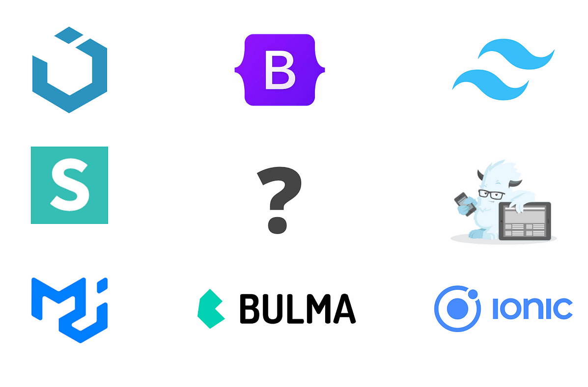
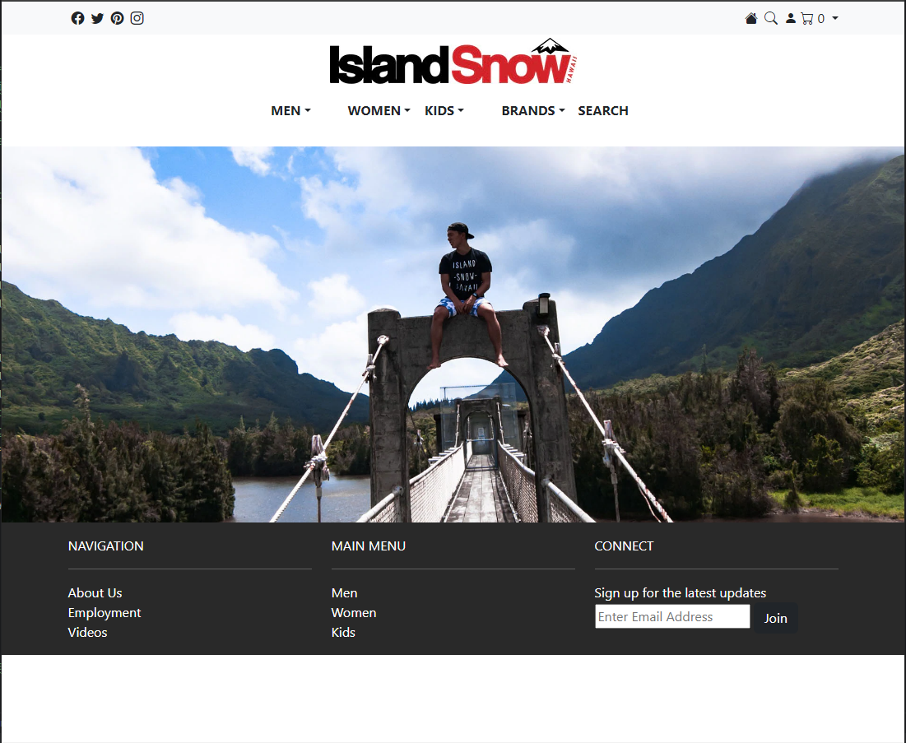
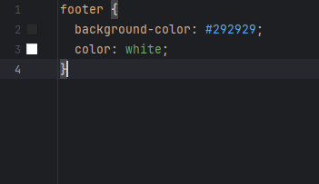

## What is a UI-Framework 

A UI (User Interface) framework serves as a toolbox for developers, equipped with pre-built code libraries, components, and tools. Its purpose is to assist developers in creating uniform and visually appealing user interfaces. By offering standardized methods for UI design and implementation, these frameworks help streamline the development process and ensure a consistent look and feel across various sections of an application or even different applications.
Within these UI frameworks, there is an assortment of components such as buttons, forms, navigation menus, sliders, and other interactive elements which also they often have pre-designed layouts, themes, and stylesheets. This feature enables developers to quickly tailor the appearance of their applications. Prominent examples of UI frameworks include Bootstrap, Material-UI, Foundation, Semantic UI, and UIKit.

## Using Bootstrap5

Before learning how to use Bootstrap, all of the web pages were made using pure HTML and CSS. Consequently, the CSS stylesheets and primary index files became riddled with numerous details like padding, margins, and a plethora of classes for elements like navbars, headers, and footers. However, once implementing Bootstrap, tasks like navbar creation, which demanded a lot of coding, now have become effortlessly simple and accomplished in a few lines of code.

In Bootstrap, assigning an element the navbar class simplified the tedious formatting and streamlined the process significantly. However, mastering the art of utilizing Bootstrap effectively was not without some effort. Navigating the learning curve involved not only discovering the available functions but also figuring out the most fitting ones for my specific development needs.

## Streamlining Development
Below is an an examples of using Bootstrap to create a webpage and the assiciated stylesheet. The overall stylesheet is very streamlined for a site with a good amount of functionality such as a navigation bar and dropdown menus. 

