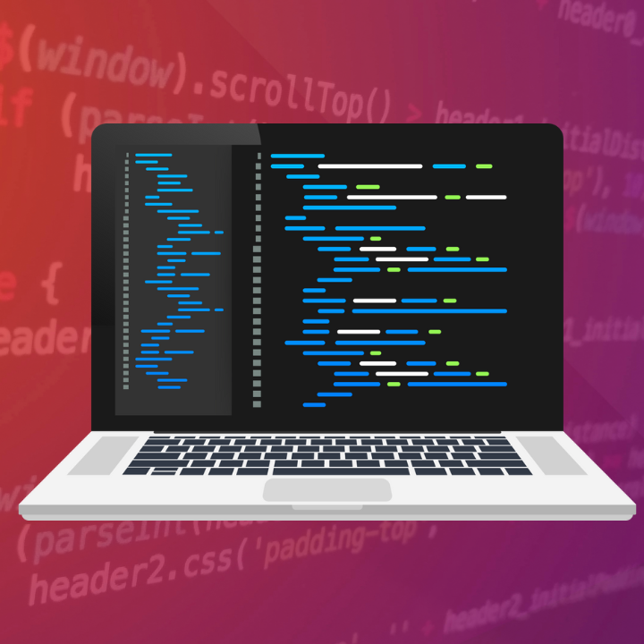

## The Technological Spark  

Throughout my upbringing, I was almost always interested in technology and how these devices that we take for granted work, from smartphones to computers. As I went through school I also discovered my hobby for participating in Robotics programs such as VEX and FIRST. Participating in these programs allowed me to develop engineering skills such as problem solving, working with specified constraints, and programming along with many soft skills. However, it was in High School that I took my first computer science class, and the real depth of coding and programming was really shown to me. Personally, even though the basics of programming and logical thinking behind the class activities and small projects was a good introduction to what you could do with the skill, I never got the opportunity to make something that involved a more comprehensive use of software engineering such as creating a functional application or website.

## Combining Both Worlds 

When it had become time to decide on what major to pursue in college I was torn on what to pick. I had years of experience participating in robotics in which I would be involved in almost every aspect of the process from building and fabricating to electronics and programming. Logically, a lot of my peers had decided to go into mechanical engineering and fields that are closely related to the fabrication aspect of robotics, but I still had a soft spot for programming and computer science. So when it came to selecting a major computer engineering seemed like a good pick in which it still involves developing programming skills, along with the ability to focus on building and designing something physical which I still enjoyed.  As I had progressed through my engineering courses such as EE 260 and EE 361 focusing more on computer hardware and EE 205 focusing more on programming, it gave a pretty good look into what computer engineering is and how the design of software and hardware are fundamentally linked.

## A Plethora of Opportunities

Since this class mainly focuses on software and the development cycle, areas where I do not have much knowledge and experience, I am genuinely enthusiastic about the opportunity to learn. I am looking forward to diving more into the hard programming skills like Javascript, HTML, CSS for web development and also getting more experience with soft skills such as programming with a small team using GitHub. After seeing the power that web development has, I’m looking forward to learning the skills and how to apply them later in my career.
