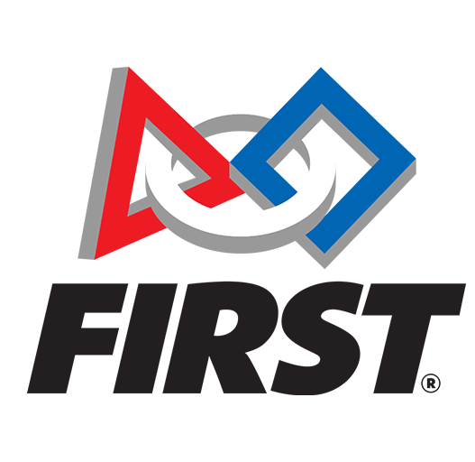

  

Throughout high school and middle school, I have participated in my school's robotics team and competed in various tournaments. In high school I had participated in the FIRST Robotics competiion, which is one of the largest competions that can be eneterd. This involved using skills such as fabricating parts, understanding the engineering design process, wiring and simple electronics, and programming the robot for both autonomous and remote control. In addition it involved soft skills such as cooperation within a group, communicating ideas effectively, and time and project management. 

For this project, I was the main build lead, so I was involved in all aspects of the design process from building and designing subsystems to electronics and programming.
