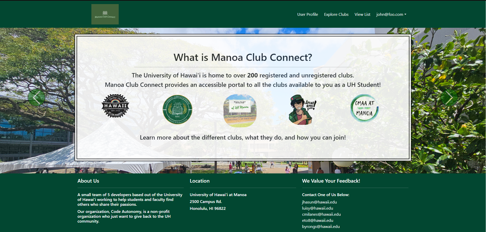

# Manoa Club Connect
 Manoa Club Connect is a web application developed by a group of 5 people using the skills and concepts developed in ICS 314 throughout the semester. The purpose of this application is to provide a site for students and Registered Independent Organiztions(RIOs) to connect and increase membership based on the interests of the users.

   
 On the app, users can sign up for an account and create their profile by specifying their display name, uploading a profile picture, and stating their interests that allign with the clubs that they would like to join. Once the interests are selected, clubs that fit their interests will appear on their profile. Clubs organizers are able to edit their information and post annoucements about club events and meetings.
   
The link to the organization page can be found [here](https://code-autonomy.github.io/)

# Contributions
The team comprised Byron, Luis, Eisen, Josh, and myself. Collectively, we adopted a strategy of distributing tasks evenly, ultilizing agile project management principles. Specifically, we implemented Issue Driven Project Management for this assignment. Through GitHub projects, we assigned work and tasks as issues, each to be developed on separate branches.

In this project, I undertook several responsibilities, including crafting the club categories and user profile pages, creating the editing forms for the user, and addressing miscellaneous tasks that posed challenges for my teammates.
   

# Lessons Learned 
This project provided valuable insights into collaborative development and allowed me to apply the skills and knowledge acquired from previous coursework. Through this experience, I've seen growth in my abilities as a software developer and improved my effectiveness in team settings.